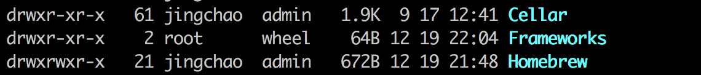
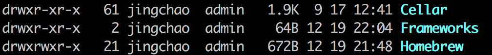

## 脚本参考

[python生成百万级URL的sitemap文件](https://blog.csdn.net/a906423355/article/details/78115048)

## 运行

brew install python3

python3 sitemap.py

## 了解python

[python3入门](https://www.liaoxuefeng.com/wiki/0014316089557264a6b348958f449949df42a6d3a2e542c000)

[解释了ASCII、Unicode和UTF-8的关系，计算机系统通用的字符编码工作方式](https://www.liaoxuefeng.com/wiki/0014316089557264a6b348958f449949df42a6d3a2e542c000/001431664106267f12e9bef7ee14cf6a8776a479bdec9b9000)

## 解决问题

brew install python3 遇到无法 brew link python

```
Error: An unexpected error occurred during the `brew link` step
The formula built, but is not symlinked into /usr/local
Permission denied @ dir_s_mkdir - /usr/local/Frameworks
Error: Permission denied @ dir_s_mkdir - /usr/local/Frameworks
```
解决方法：
sudo mkdir /usr/local/Frameworks

sudo chown $(whoami):admin /usr/local/Frameworks

brew link python

python3 -V

[参考](http://www.cnblogs.com/meng1314-shuai/p/9031686.html)

## mac/linux 直接运行py文件

添加头部
```
#!/usr/bin/env python3
```
修改权限
```
chmod a+x example.py
```


